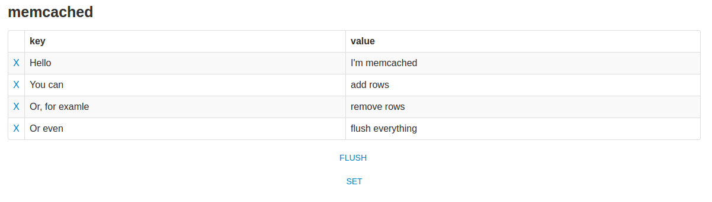

# memcached-dump



Simple fast and easy read-write access to Memcache**d**

## Table of Contents

- [Features](#features)
- [Requirements](#requirements)
- [Installation](#installation)
- [Known Limitations](#known-limitations)  
- [License »](LICENSE)  

## Features

 - Fast and furious
 - Easy and stupid
 - Add and remove entries
 - Flush everything without doubts

#### Notice
This software is currently in early alpha state and so i want to warn - There is currently no ciritcal bug i know about but maybe still some potential for (Memcached) data loss - from my point of view its not critical in development cause it's a non-persistent memory store we're talkin about - but it's just fair to warn you before you use it! :)

## Requirements

 - PHP >= 5.3 (compatible up to version 7.1)

## Installation
Download the file, put to public directory, access throw your browser.
You can change connection data in the beginning of file.
```php
$server = '127.0.0.1';
$port = 11211;
```

## Known Limitations
`memcached-dump` sometimes has trouble reading data written by `PHP Memcache` and/or `PHP Memcached` (note the d at the end) extension.  
